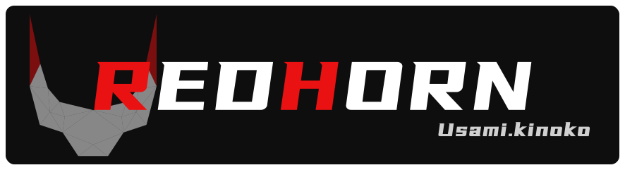

<div style="width:100%;display:flex;justify-content:center;">
  
</div>


## Bulletin Board

This project is a personal blog site developed based on Sveltekit, which is still in the development stage and no demo site has been provided yet :D

## Usage

If you are a user in China, you can use the Chinese npm mirror.

```shell
# tabao npm mirror
pnpm config set registry https://registry.npmmirror.com/
# offical mirror
pnpm config set registry https://registry.npmjs.org/
```

Install project dependencies.

```shell
pnpm install
```

## Todo

- [x] refactor with TypeScript
- [ ] optimize base layout
- [ ] optimize data loading format
- [ ] low-poly opening animation
- [ ] animation optimization
- [ ] better markdown style
- [ ] table of content component

## Supporting Tools

In the process of developing the project, in order to improve development efficiency, I wrote some simple tools.

### getPolygonFromPixso.py

I implemented a low-poly graphic animation for my homepage in this project. During development, I used Pixso to create web page prototypes. However, Pixso lacks the functionality to define irregular polygons using the `clip-path` attribute, even for a simple triangle. To streamline the creation of low-poly animations, I manually extracted graphic parameters from Pixso and converted them into the required `polygon()` parameters through calculations.

The implementation principle of this tool is very simple. You only need to understand the principle of the `polygon()` function.
